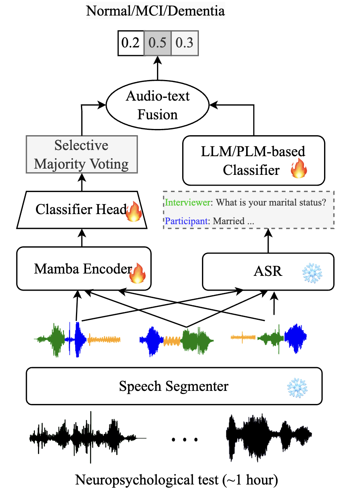

# Demenba Classifier
This is implementation of the [paper](https://arxiv.org/pdf/2507.10311) "Recognizing Dementia from Neuropsychological Tests with State Space Models" accepted by [ASRU2025](https://signalprocessingsociety.org/events/asru-2025-2025-ieee-automatic-speech-recognition-and-understanding-workshop). 

```
@inproceedings{wang2025recognizing,
  author    = {Wang, L. and Bhati, S. and Karjadi, C. and Au, R. and Glass, J.},
  title     = {Recognizing Dementia from Neuropsychological Tests with State Space Models},
  booktitle = {2025 IEEE Automatic Speech Recognition and Understanding Workshop (ASRU)},
  year      = {2025},
  pages     = {1--7},
  address   = {Honolulu, HI, USA},
  doi       = {10.1109/ASRU65441.2025.11434604}
}
```



## Getting started
Clone this repository and set it as the working directory, and install the dependencies via
```bash
conda create -n DASS python=3.12
conda activate DASS
conda install pytorch==2.3.0 torchvision==0.18.0 torchaudio==2.3.0 pytorch-cuda=12.1 -c pytorch -c nvidia
conda install -c nvidia -y cuda-toolkit=12.1 cuda-version==12.1 cuda-opencl==12.1 cuda-nvcc==12.1 cuda-compiler==12.1 cuda-cuobjdump==12.1 cuda-cuxxfilt==12.1 cuda-nvprune==12.1
conda install cxx-compiler gcc_linux-64 gxx_linux-64
pip install -r requirements.txt
```
After that, compile the Mamba-related modules via
```bash
export CONDA_ROOT=/path/to/your/conda
export CC=$CONDA_ROOT/envs/vmamba/bin/x86_64-conda-linux-gnu-cc
cd DASS/kernels/selective_scan && pip install .
```
If this step fails, consider restalling any ``cuda-*`` packages to be of version 12.1.

For text-based classifier, you will need to install additional dependencies listed in ``plm/requirements.txt``

## Data Preprocessing
Download the metadata [here](https://drive.google.com/file/d/1B-WBiW14wHBnqrKRSBD69iuTBMHzNDDk/view?usp=sharing), unzip and put it under ``data``. Then modify the first line of ``data/fhs/train_{800,1200}.tsv`` to the absolute path of your FHS speech data.

## Pretrained models
| Model name | Link |
|--|--|
|DASS-medium-2-class|[here](https://drive.google.com/file/d/1cQJyrhwdeaAyqO_10RyDnbL1_4rMheKF/view?usp=sharing)
|DASS-medium-3-class|[here](https://drive.google.com/file/d/1v0p_qGheZrIcXHS6ZNyTrknjAjGtAFGO/view?usp=sharing)
|bert-base-case-2-class|[here](https://drive.google.com/file/d/1zHW2xmQGrZ5zyQQ1UYINUCbzPn4570VJ/view?usp=sharing)

## Training audio classifier
To train a 2-class classifier with DASS-medium backbone (see ``DASS/run_fhs_dass_medium.sh``):
```bash
cd DASS
manifest_dir=/path/to/your/data
metadata_path=/path/to/your/metadata
exp_dir=/path/to/your/experiment
bash run_fhs_dass_medium.slurm 360 400 0.0001 True train WCE $manifest_dir $metadata_path $exp_dir
```

## Training text classifier
To train a 2-class text classifier with bert-based backbone (see ``plm/scripts/run_text.sh``):
```bash
cd plm/scripts
manifest_dir=/path/to/your/data
metadata_path=/path/to/your/metadata
exp_dir=/path/to/your/experiment
bash run_text.slurm bert-base-cased mlp 1 400 180 1 $manifest_dir $metadata_path $exp_dir train
```

## Inference
To test a trained 2-class classifier with DASS-medium backbone:
```bash
manifest_dir=/path/to/your/data
metadata_path=/path/to/your/metadata

# Audio classifier
cd DASS
audio_exp_dir=/path/to/your/audio/classifier
bash run_fhs_dass_medium.slurm 360 400 0.0001 True test WCE $manifest_dir $metadata_path $audio_exp_dir
cd ..

# Text classifier
cd plm/scripts
text_exp_dir=/path/to/your/text/classifier
bash run_text.slurm bert-base-cased mlp 1 400 180 1 $manifest_dir $metadata_path $text_exp_dir test
cd ..

# Audio-text fusion
python utils/audio_text_fusion.py --audio-score-path $audio_exp_dir/pred_scores.npy \
	--text-score-path $text_exp_dir/pred_scores.npy \
	--true-label-path $audio_exp_dir/gold_labels.npy \
	--out-path $audio_exp_dir/fusion_result.tsv
```
